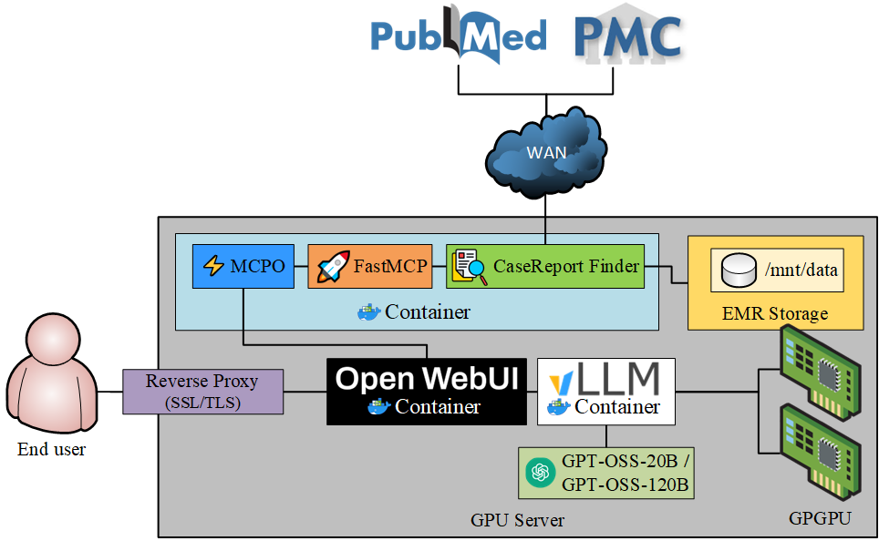
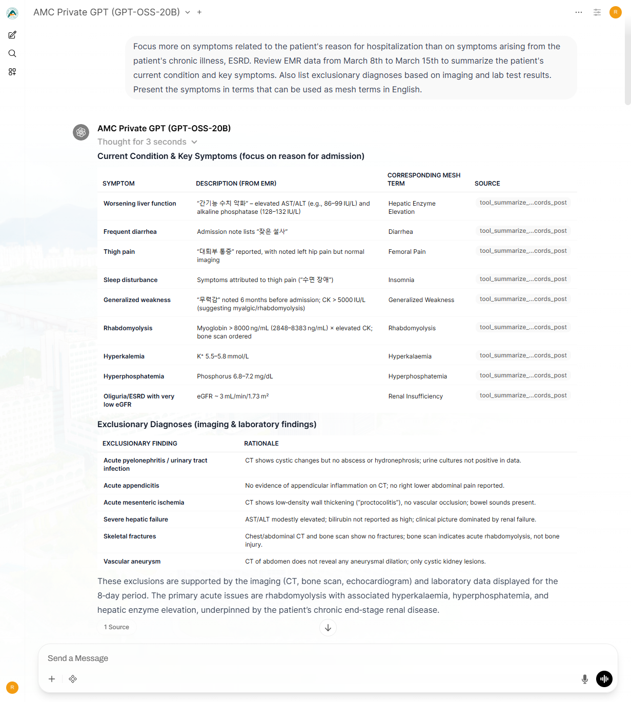
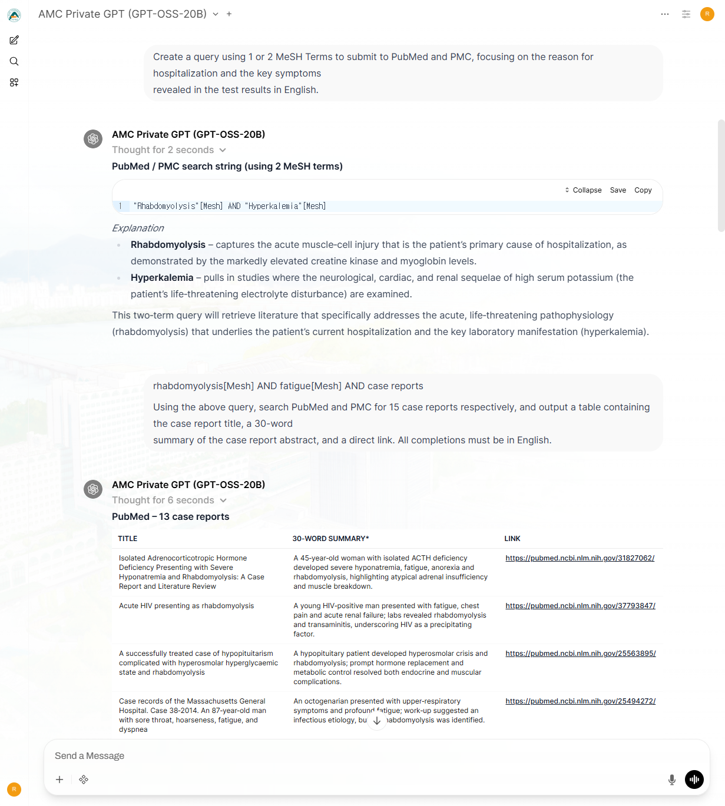
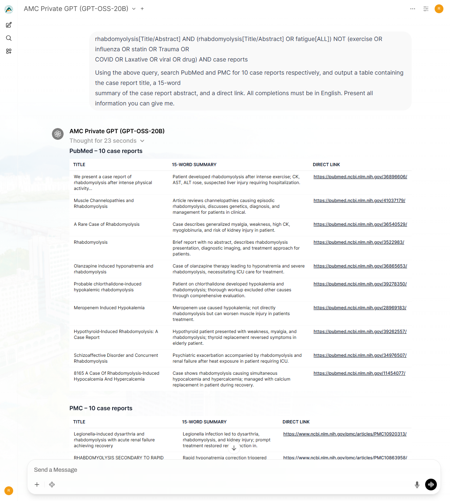

# DDx-Finder

An AI-powered medical literature search and case report discovery system using LLM, Open WebUI, and MCP (Model Context Protocol).

[](https://opensource.org/licenses/MIT)
[](https://www.python.org/downloads/)

## 🎯 Overview

DDx-Finder is an AI-powered web service that helps medical professionals efficiently search and analyze relevant case reports for differential diagnosis of rare diseases and complex clinical cases. It integrates multiple medical databases (PubMed, PMC) and provides intelligent patient data analysis through the Model Context Protocol (MCP).

### ✨ Key Features

- 🔍 **Multi-Database Search**: Unified search across PubMed and PMC
- 🤖 **LLM-Powered Analysis**: Intelligent literature analysis powered by opensource LLM models
- 📊 **Patient Data Integration**: Automated analysis of lab results and medical records
- 🌐 **User-Friendly Interface**: Built on Open WebUI for intuitive interaction
- 🔌 **Extensible Architecture**: MCP-based modular tool integration

## 🏗️ Architecture

- **Serving LLM**: vLLM v0.10.2-x86_64 for gpt-oss-20b/120b serving 
- **Web Interface**: Open WebUI v0.6.34 based on Node.js v22.21.1 for clinical interaction 
- **MCP Integration**: FastMCP v2.12.4, MCPO v0.0.19 for EMR parsing and literature search MCP servers



## 🚀 Quick Start

### Prerequisites

- **Docker** and **Docker Compose**
- **SLURM** (optional, for HPC environments)
- **GPU** (optional, for local vLLM deployment)
    * GPU Requirements

        For optimal performance with local LLM deployment, the following GPU specifications are recommended based on model size:

        | Model | Minimum GPU | Recommended Setup | Precision |
        |-------|-------------|-------------------|-----------|
        | **GPT-OSS-120B** | 2× NVIDIA A100 (80GB) | 4× NVIDIA A100 (80GB) | FP4/INT4 quantization |
        | **GPT-OSS-20B** | 1× NVIDIA RTX 3090 (24GB) | 1× NVIDIA A100 (40GB) | FP4/INT4 quantization |

### Installation

1. **Clone the repository**

```bash
git clone https://github.com/yourusername/DDx-Finder.git
cd DDx-Finder
```

2. **Launch services**

Using SLURM (HPC environment):

```bash
# Launch Open WebUI & MCPO server
sbatch launch-webui.sh

# Launch vLLM (optional, for local LLM)
sbatch launch-vllm.sh
```

Using Docker Compose directly:

```bash
# Launch Open WebUI & MCPO server
docker-compose up webui

# Launch vLLM
docker-compose up vllm
```

## 📖 Usage

### Example dialogue







## 🛠️ MCP Tools

### CRFinderV11 (Medical Literature Search)

Defined in [`multi_db_mcp_server_v11.py`](mcp/multi_db_mcp_server_v11.py):

- **`search_literature()`**: Multi-database integrated search
- **`get_query_examples()`**: Database-specific query examples
- **`get_pubmed_query_guide()`**: Advanced PubMed query construction guide

### CR_filesystem_v7 (Patient Data Analysis)

Defined in [`CR_filesystem_v7.py`](mcp/CR_filesystem_v7.py):

- **`summarize_medical_records()`**: Intelligent medical record summarization
- **`get_full_lab_data()`**: Complete lab results for specific dates
- **`get_document_content()`**: Retrieve individual document contents

### Standard MCP Servers

- **memory**: Conversation context storage
- **time**: Time/date information
- **filesystem**: File system access
- **sequential-thinking**: Step-by-step reasoning

### Configuration

MCP servers are configured in [`configs/mcp.json`](`/app/mcp/mcp.json` in the mcpo container):

```json
{
  "mcpServers": {
    "CRFinderV11": {
      "command": "python",
      "args": ["/app/mcp/multi_db_mcp_server_v11.py"]
    },
    "CR_filesystem_v7": {
      "command": "python",
      "args": ["/app/mcp/CR_filesystem_v7.py"],
      "env": {
        "LAB_WORK_DIR": "/mnt/data/"
      }
    }
  }
}
```

Learn more about MCP at the [Model Context Protocol documentation](https://modelcontextprotocol.io/).

### Environment Variables

Key environment variables in [`docker-compose.yml`](docker-compose.yml):

- `TZ`: Timezone setting
- `WEBUI_SECRET_KEY`: Open WebUI secret key
- `TIKTOKEN_ENCODINGS_BASE`: Tiktoken encodings directory (for vLLM)

## 🤝 Contact & Contributing

For questions or support, please open an issue on [GitHub Issues](https://github.com/yourusername/DDx-Finder/issues).
Contributions are welcome! Please feel free to submit a Pull Request or open an Issue.

## 📝 License

This project is licensed under the MIT License - see the [LICENSE](LICENSE) file for details.

## 📄 Citation

If you use DDx-Finder in your research, please cite our paper:

```bibtex
@article{,
  title={DDx-Finder: A Modular MCP-Based System for LLM-Assisted Differential Diagnosis from EMR and Literature},
  author={Hyunseok Lim, Junyoung Yoon, Hahn Yi, Heeyeon Kwon, Dong-Wook Lee and Namkug Kim},
  journal={arXiv preprint arXiv:XXXX.XXXXX},
  year={2025}
}
```

## ⚠️ Disclaimer

**Note**: This project is designed for research and educational purposes only. Always consult with qualified medical professionals for clinical decisions. This tool is not a substitute for professional medical advice, diagnosis, or treatment.

**Legal**: The authors and contributors are not responsible for any medical decisions or outcomes based on the use of this software. Users assume all risks and responsibilities when using this tool in clinical or research settings.